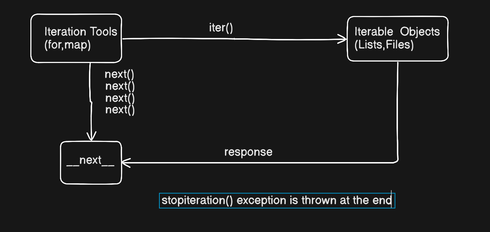

# Loops Behind the scenes

- Iteration ==>Doing the task again anf again
- Iteration Tools ==>Tools we use for iteration in python ==> for,while,map,comprehension
- Iterable Objects ==>Objects that can be iterated ==> lists,files,etc
- __next__ or next() ==>Response sent by iterable objects
- iter() ==> Method sent by the iteration tools to get the response
<hr>

- Obects are contiguious memory location and points at the start of the object
- While iterating the iteration tools sends iter() to the objects and they sends next() value pointing the next memory location in it
- When there is no location left to point in the contiguious memory stopiteration() exception is thrown 

<br>
<hr>

## File and Readline

- open("path or name") ==>Opens the file for performing the actions
- readline() ==>Reads the line from file
- When the file ends readline gives '' as an output
 ``` Python
>>> file = open("practice.py")
>>> file.readline()
'import time\n'
>>> file.readline()
'print("Chai is Hot")\n'
>>> file.readline()
'username = "Bankai : Tensa Zangetsu"\n'
>>> file.readline()
'print(username)'
>>> file.readline()
''
>>> file.readline()
''
```

- We can also use __next__() to do the same but it is the raw method to do it.It throws stopiteration exception and crashes the program
```python
>>> file = open("practice.py")
>>> file.__next__()
'import time\n'
>>> file.__next__()
'print("Chai is Hot")\n'
>>> file.__next__()
'username = "Bankai : Tensa Zangetsu"\n'
>>> file.__next__()
'print(username)'
>>> file.__next__()
# Error
Traceback (most recent call last):
  File "<stdin>", line 1, in <module>
    file.__next__()
    ~~~~~~~~~~~~~^^
StopIteration
```

- Printing the file using for loop
```python
>>> file = open("practice.py")
>>> for line in file:         
...     print(line, end= "")  
... 
import time
print("Chai is Hot")
username = "Bankai : Tensa Zangetsu"
print(username)
```

- Printing the file using while loop
``` python
>>> file = open("practice.py")
>>> while True:               
...     line = file.readline()
...     if not line:break
...     print(line,end = "")
... 
import time
print("Chai is Hot")
username = "Bankai : Tensa Zangetsu"
print(username)
```

## Iteration in Lists

- iter() has the memory ref of the starting of the contiguious memory location
- The reference in iter() does not change when the __next__() is used.but next() points to the immediate next location in the memory
- The stopitration exception is also thrown
```python
>>> myList = [1, 2 , 3 , 4 ]
>>> memory_ref = iter(myList)
>>> memory_ref
<list_iterator object at 0x000001FDFC2E05B0>
>>> memory_ref.__next__()
1
>>> memory_ref.__next__()
2
>>> memory_ref.__next__()
3
>>> memory_ref.__next__()
4
>>> memory_ref.__next__()
Traceback (most recent call last):
  File "<stdin>", line 1, in <module>
    memory_ref.__next__()
    ~~~~~~~~~~~~~~~~~~~^^
StopIteration
>>> 
```
## Iteration in Dictionary

```python
>>> D = {'a':1,'b':2}
>>> for key in D.keys():
...     print(key)
... 
a
b
>>> I = iter(D)
>>> I
<dict_keyiterator object at 0x000001FDFCABEE80>
>>> I.__next__()
'a'
>>> 
>>> I.__next__()
'b'
>>> I.__next__()
Traceback (most recent call last):
  File "<stdin>", line 1, in <module>
    I.__next__()
    ~~~~~~~~~~^^
StopIteration
```

## Iteration in Range
``` python
>>> R = range(5)
>>> I = iter(R)
>>> I
<range_iterator object at 0x000001FDFC528350>
>>> I.__next__()
0
>>>
>>> I.__next__()
1
>>> I.__next__()
2
>>> I.__next__()
3
>>> I.__next__()
4
>>> I.__next__()
Traceback (most recent call last):
  File "<stdin>", line 1, in <module>
    I.__next__()
    ~~~~~~~~~~^^
StopIteration
```
